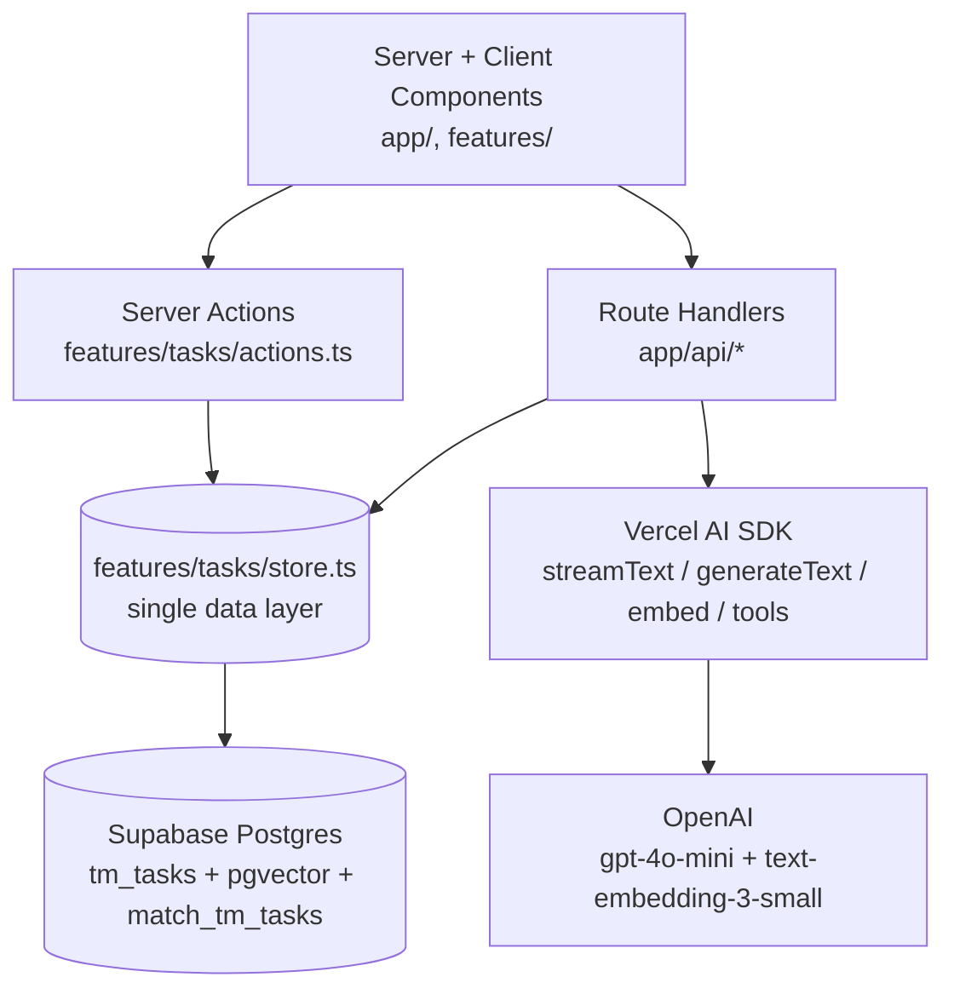

# Task Manager AI

> An AI-powered task manager with chat, classification, and semantic search.

🔗 **[Live demo](https://task-manager-ai-staging.up.railway.app/)** · 📂 **[Portfolio](https://julianlopez.dev)** · 💻 **[Source on GitHub](https://github.com/stivenslop2/task-manager-ai)**

---

## The problem it solves

Most personal task lists become noise within a week — too many entries, no priorities, and no easy way to find that thing you wrote down a month ago. Task Manager AI lets you brain-dump tasks in plain language, then uses an LLM to classify, prioritize, and recall them through chat or semantic search. It's a working showcase of the production patterns I use when shipping AI features into real product flows.

---

## AI techniques demonstrated

| Technique | Implementation | Where to look |
|-----------|----------------|---------------|
| Streaming text generation | Token-by-token "Generate steps" via `streamText` + `toUIMessageStreamResponse`, consumed client-side by a hand-rolled SSE async iterator. | `app/api/describe-task/route.ts`, `features/ai/stream.ts` |
| Tool-calling agent | Multi-step chat that searches, reads, creates, and summarizes tasks. `stepCountIs(5)` caps the agent loop. | `app/api/chat/route.ts`, `features/chat/components/Chat.tsx` |
| Structured outputs (Zod) | Schema-validated classification (category / difficulty / tags / deadline) and full task-list analysis with priority + score. | `app/api/classify-task/route.ts`, `features/ai/analysis.ts` |
| RAG with pgvector | On insert, title + description is embedded with `text-embedding-3-small` (1536-dim); the chat agent's `searchTasks` tool calls a Postgres function ranking by cosine similarity. | `lib/embeddings.ts`, `features/tasks/store.ts` |

---

## Stack

- **Framework:** Next.js 16 (App Router, Turbopack, Server Actions, Suspense streaming)
- **Runtime:** React 19, TypeScript 5
- **AI:** Vercel AI SDK v6 with `@ai-sdk/openai`; `@anthropic-ai/sdk` direct for image analysis
- **Database:** Supabase Postgres + `pgvector` extension
- **Styling:** Tailwind CSS 4 with `@theme` tokens

---

## Architecture



- All Supabase access is funneled through `features/tasks/store.ts`; route handlers and components never touch the client directly.
- Structured-output logic lives in `features/ai/*.ts` as plain server functions, so Server Components (`/tasks/analysis`) can call it without an HTTP round-trip while route handlers reuse the same code.
- `app/` is routing only; feature code lives under `features/{ai,chat,tasks}/` so each capability owns its types, components, and server logic.
- Chat uses `useChat` + `DefaultChatTransport` on the client and exposes typed tools (`searchTasks`, `getTasks`, `createTask`, ...) on the server.

---

## Notable engineering decisions

### pgvector over a managed vector DB

Tasks already live in Postgres, so adding the `vector` extension keeps embeddings, rows, and ACID guarantees in one store. No second system to provision, no eventual-consistency window between "task created" and "task searchable", and no extra network hop on every query. A managed vector DB would only pay off above a scale this app does not need.

### ivfflat over HNSW for current scale

The `tm_tasks` index uses `ivfflat (embedding vector_cosine_ops) with (lists = 100)`. ivfflat trains faster, uses less memory, and is well-suited to the small/medium row counts a personal task list produces. HNSW would give better recall under heavy load — a worthwhile switch later, but premature today.

### Feature-sliced folder structure

Code is grouped by capability (`features/ai/`, `features/chat/`, `features/tasks/`) instead of by technical layer (`components/`, `hooks/`, `lib/`). Each feature owns its types, server logic, and components, which keeps churn local and makes the boundary between "task domain" and "AI plumbing" obvious to anyone reading the repo.

---

## Run locally

```bash
git clone https://github.com/stivenslop2/task-manager-ai
cd task-manager-ai
npm install
cp .env.example .env.local  # fill in keys
npm run dev
```

Open <http://localhost:3000>.

Required environment variables:

- `NEXT_PUBLIC_SUPABASE_URL`
- `SUPABASE_SERVICE_ROLE_KEY`
- `OPENAI_API_KEY` (or `ANTHROPIC_API_KEY` if swapping providers)

---

## What's next

- [ ] Deploy to Vercel (currently running on Railway staging)
- [ ] Add Supabase Auth so tasks are scoped per user
- [ ] Multi-modal task attachments (image OCR + summarization via the existing `app/api/analyze-image/route.ts` path)

---

## About

Built by **Julian Lopez** — AI Engineer · Full Stack.
[Portfolio](https://julianlopez.dev) · [LinkedIn](https://www.linkedin.com/in/stiven-julian-lopez/) · [GitHub](https://github.com/stivenslop2)

License: MIT
